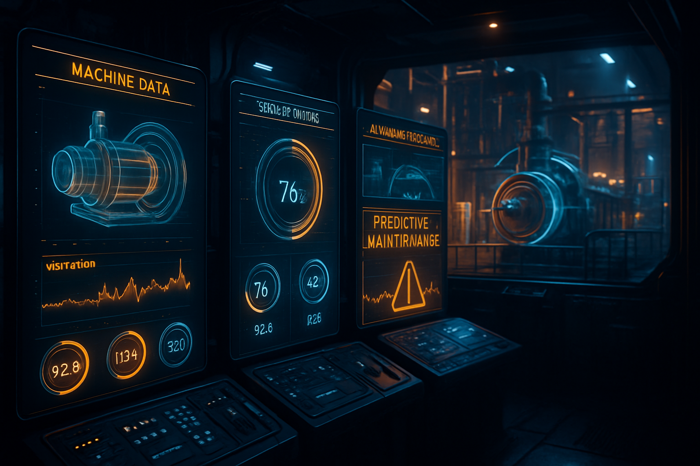
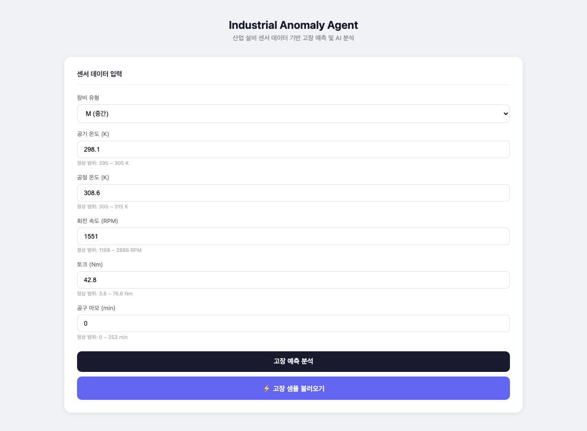
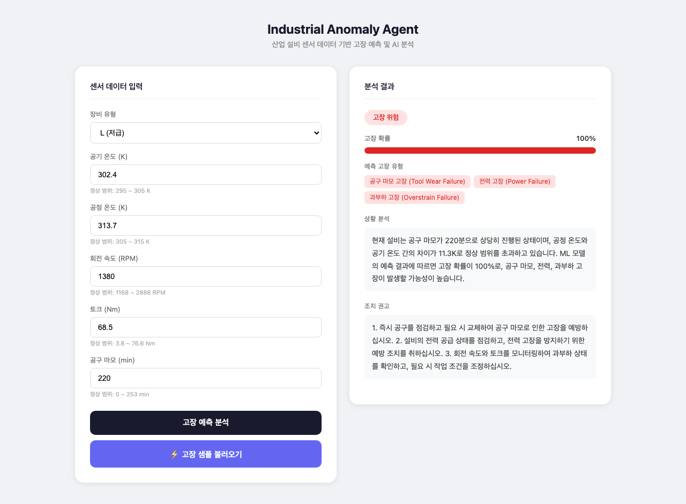

# Industrial Anomaly Agent



산업 설비 센서 데이터 기반 고장 예측 및 AI 분석 시스템

## 데모

| 입력 화면 | 분석 결과 |
|-----------|-----------|
|  |  |

## 기술 스택

- **ML**: XGBoost (이진 분류 + 고장 유형별 멀티레이블)
- **LLM**: GPT-4o-mini (LangChain)
- **Backend**: FastAPI
- **Dataset**: [UCI AI4I 2020 Predictive Maintenance](https://archive.ics.uci.edu/dataset/601/ai4i+2020+predictive+maintenance+dataset)

## 주요 기능

- 6가지 센서 입력 (공기 온도, 공정 온도, RPM, 토크, 공구 마모, 장비 유형)
- XGBoost 기반 고장 확률 예측
- 5종 고장 유형 감지 (TWF, HDF, PWF, OSF, RNF)
- GPT-4o-mini 기반 한국어 상황 분석 및 조치 권고

## 실행 방법

```bash
# 가상환경 설정
python3 -m venv .venv
source .venv/bin/activate
pip install -r requirements.txt

# 환경변수 설정
cp .env.example .env
# .env에 OPENAI_API_KEY 입력

# 모델 학습 (최초 1회)
curl -X POST http://localhost:8000/train

# 서버 실행
uvicorn app.main:app --reload
```

브라우저에서 http://localhost:8000 접속

## API

| Method | Path | 설명 |
|--------|------|------|
| POST | /predict | 고장 예측 및 AI 분석 |
| POST | /train | 모델 학습 |
| GET | /health | 헬스 체크 |
