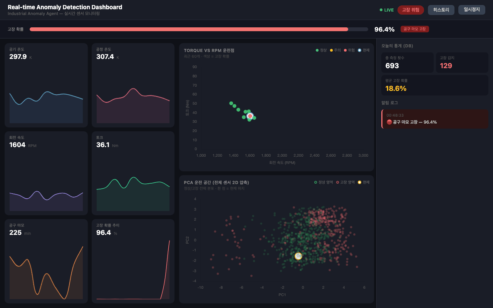
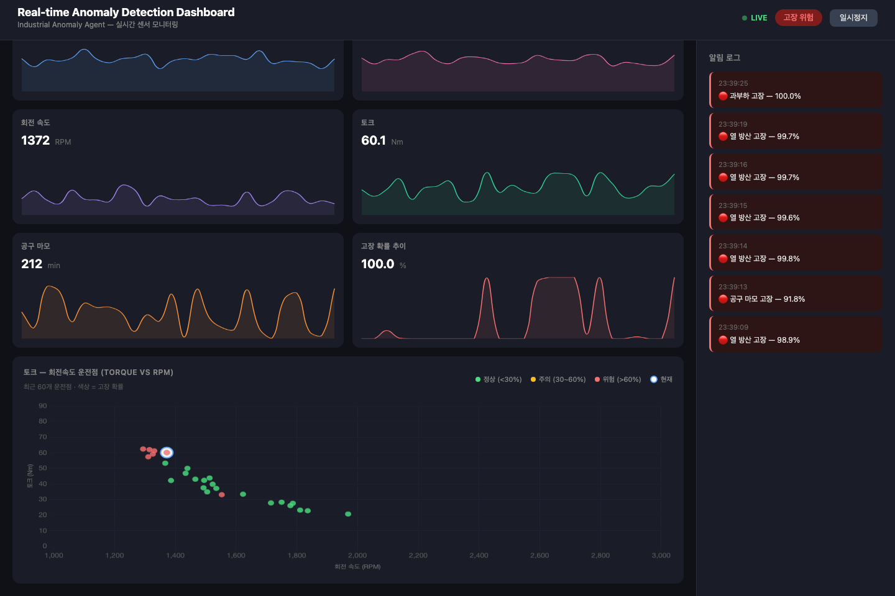
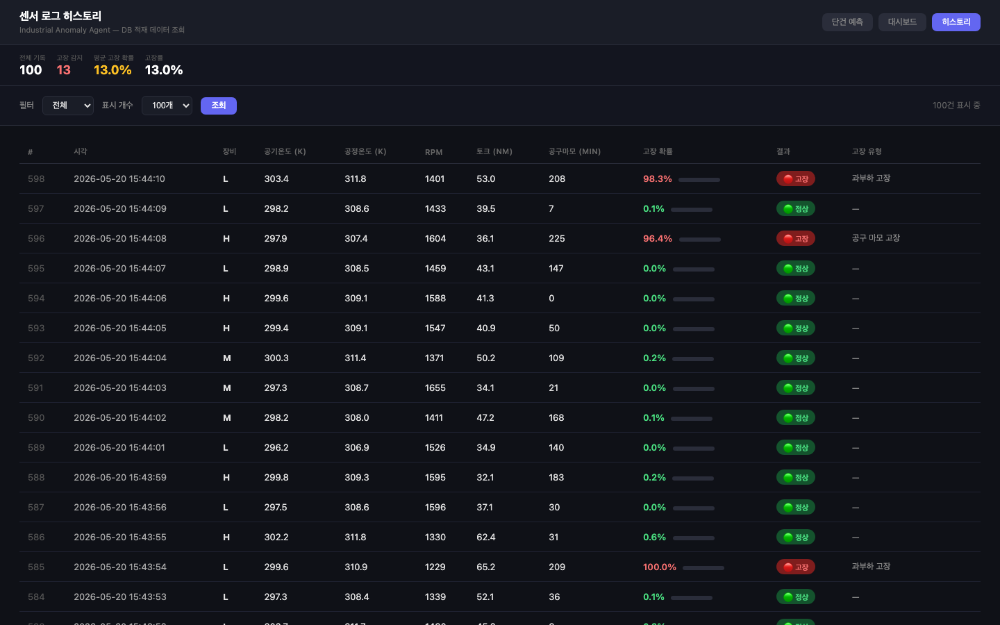

# Industrial Anomaly Agent


<p align="center">
  
  
  
  
  
  
  
</p>

<p align="center">
산업 설비 센서 데이터를 실시간으로 수집·분석하여 고장을 예측하고,<br/>
LLM이 현장 엔지니어에게 한국어로 상황 분석과 조치 권고를 제공하는 AI 에이전트입니다.
</p>

---

## 데모

### 실시간 이상 감지 대시보드


### 토크-RPM 운전점 & PCA 클러스터 시각화


### 단건 예측 + AI 분석
| 입력 화면 | 분석 결과 |
|-----------|-----------|
|  |  |

### 센서 로그 히스토리 (DB)


---

## 아키텍처

```
센서 데이터 입력
      │
      ▼
┌─────────────────┐
│   Simulator     │  CSV 재생 (UCI AI4I 2020)
│   (MQTT 교체 가능) │  ─→ 실제 센서 연동 시 MQTT로 교체
└────────┬────────┘
         │ 1초마다
         ▼
┌─────────────────┐     ┌──────────────┐
│  XGBoost Model  │────▶│  PostgreSQL  │ 히스토리 적재
│  + PCA          │     └──────────────┘
└────────┬────────┘
         │
         ▼
┌─────────────────┐
│  GPT-4o-mini    │ 한국어 상황 분석 + 조치 권고
│  (LangChain)    │
└────────┬────────┘
         │
         ▼
┌─────────────────────────────────┐
│  FastAPI + WebSocket            │
│  ├── /           단건 예측 UI   │
│  ├── /dashboard  실시간 대시보드 │
│  ├── /history    로그 히스토리   │
│  └── /ws/stream  WebSocket 스트림│
└─────────────────────────────────┘
```

---

## 주요 기능

| 기능 | 설명 |
|------|------|
| **고장 예측** | XGBoost 이진 분류 (정확도 99%) + 5종 고장 유형 감지 |
| **AI 분석** | GPT-4o-mini 한국어 상황 분석 및 조치 권고 |
| **실시간 대시보드** | WebSocket 1초 스트리밍, 6개 센서 라이브 차트 |
| **운전점 시각화** | Torque-RPM 산점도 + PCA 2D 정상/고장 클러스터 |
| **DB 히스토리** | 모든 측정 데이터 PostgreSQL 적재, 필터 조회 |
| **자동 학습** | 서버 시작 시 모델 없으면 자동 학습 |
| **Docker 배포** | `docker-compose up` 한 줄로 전체 스택 실행 |

---

## 빠른 시작

### Docker (권장)

```bash
git clone https://github.com/sauuri/industrial-anomaly-agent.git
cd industrial-anomaly-agent

cp .env.example .env
# .env에 OPENAI_API_KEY 입력

docker-compose up --build
```

브라우저에서 http://localhost:8000 접속 — 모델 학습 자동 실행

### 로컬 실행

```bash
python3 -m venv .venv && source .venv/bin/activate
pip install -r requirements.txt

cp .env.example .env  # OPENAI_API_KEY 입력

uvicorn app.main:app --reload
# 서버 시작 시 모델 자동 학습
```

---

## 기술 스택

| 분류 | 기술 |
|------|------|
| ML | XGBoost, scikit-learn (PCA, StandardScaler) |
| LLM | GPT-4o-mini, LangChain |
| Backend | FastAPI, WebSocket, SQLAlchemy |
| Database | PostgreSQL (Docker) / SQLite (로컬) |
| Frontend | Chart.js, Vanilla JS |
| Infra | Docker, docker-compose |
| Dataset | [UCI AI4I 2020 Predictive Maintenance](https://archive.ics.uci.edu/dataset/601/ai4i+2020+predictive+maintenance+dataset) |

---

## API

| Method | Path | 설명 |
|--------|------|------|
| GET | / | 단건 예측 웹 UI |
| GET | /dashboard | 실시간 모니터링 대시보드 |
| GET | /history | 센서 로그 히스토리 |
| WS | /ws/stream | WebSocket 센서 스트림 |
| POST | /predict | 고장 예측 및 AI 분석 |
| GET | /api/stats | 오늘의 통계 |
| GET | /api/history | 로그 조회 (limit 파라미터) |
| GET | /api/pca-background | PCA 배경 클러스터 데이터 |
| POST | /train | 모델 학습 |
| GET | /health | 헬스 체크 |

---

## License

MIT
